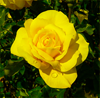
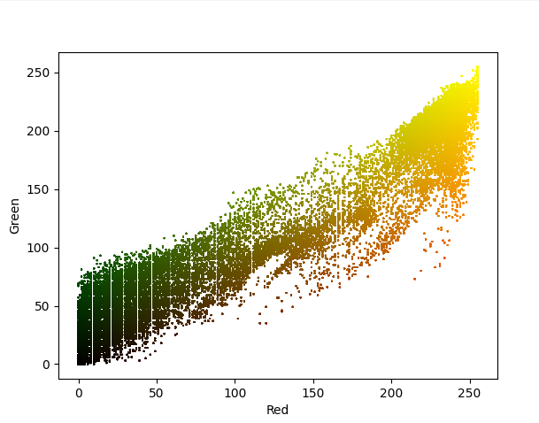
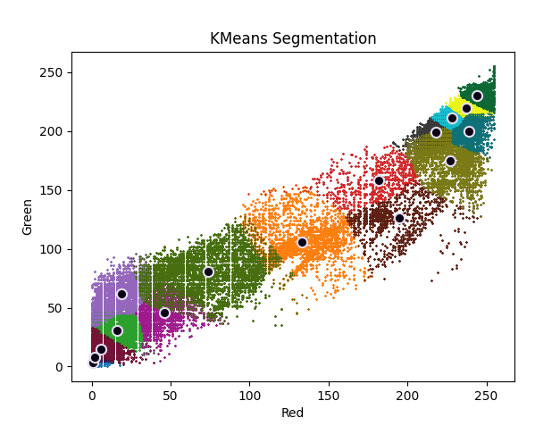
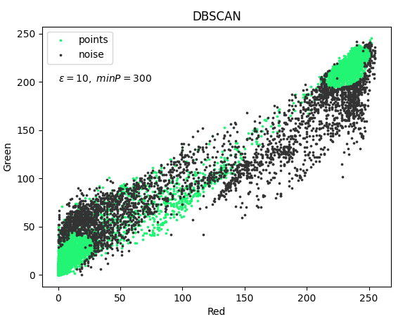
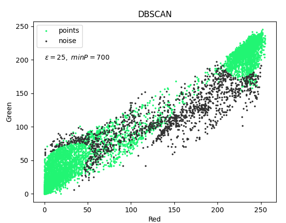

A simple repository created with the idea of learning Go and Machine Learning by creating from scrath different type of ML algorithms, ranging from supervised and unsupervised ML.

## Supervised Machine Learning

- Naive Bayes classifier
  - Implemented using [Multinomial Naive Bayes](https://scikit-learn.org/stable/modules/naive_bayes.html#multinomial-naive-bayes) with smoothing priors equal to 1
- KNN
  - Implemented using [Ball Tree data structure](https://web.archive.org/web/20251219030314/https://citeseerx.ist.psu.edu/document?repid=rep1&type=pdf&doi=17ac002939f8e950ffb32ec4dc8e86bdd8cb5ff1), [Wikipedia](https://en.wikipedia.org/wiki/Ball_tree)
- Decision Tree
  - Implemented using [ID3 Algorithm](https://en.wikipedia.org/wiki/ID3_algorithm)
- Linear Regression
  - implementation based on [Artificial Intelligence: foundations of computational agents](https://artint.info/3e/html/ArtInt3e.Ch7.S3.html) algorithm
  - Implemented using stochastic gradient descent
  - Mean Squared Loss as my loss function
  - Added a Regularization Term using L2 norm

### Classification Result

| Model                  | Recall | Precision | Accuracy | Note                                                                                       |
| :--------------------- | :----: | :-------: | :------: | :----------------------------------------------------------------------------------------- |
| Naive Bayes classifier |  0.97  |   0.99    |   0.97   | smoothing priors set to `1`.                                                               |
| KNN                    |  0.86  |   0.72    |   0.64   | k set to `32`.                                                                             |
| Decision Tree          |   1    |   0.75    |   0.75   | Max depth set to `25` and the minimun amount of node required for a split is set to `100`. |

Dataset info:

- Training set size: 15859 documents
- Test set size: 5812 documents

### Regression Result

| Model             | Mean Absolute Error | Note                                                                                                                                                               |
| :---------------- | :-----------------: | :----------------------------------------------------------------------------------------------------------------------------------------------------------------- |
| Linear Regression |        1.272        | Regularization strength set to `0.5`, batch size equals to `30` and `550` epochs. The MAE value was averaged over 5 independent runs using different random seeds. |

Dataset info:

- Training set size: 152 examples
- Test set size: 26 examples

## Unsupervised Machine Learning

- K-Means
  - Implemented using [Lloyd's algorithm](https://en.wikipedia.org/wiki/K-means_clustering)
  - Implemented Forgy method as initialization methods
- DBSCAN
  - Implemented with the following algorithm: [Wikipedia](https://en.wikipedia.org/wiki/DBSCAN)

I use Python as a visualization tool for clusters.

**Original image**

**RGBA Distribution**

### K-Means result

**Cluster visualization**

### DBSCAN Result

**Note:** the original image was scaled down to a resolution of 100x96 because of too many pixels in the original image.

## Dataset

- Dataset used for classification: [Enron Spam](https://www2.aueb.gr/users/ion/data/enron-spam/)
- Dataset used for regression: [Wine recognition dataset](https://archive.ics.uci.edu/ml/machine-learning-databases/wine/wine.data)
- The data used during clustering are the RGB values of the following image [image](https://en.wikipedia.org/wiki/K-means_clustering#/media/File:Rosa_Gold_Glow_2_small_noblue.png).
